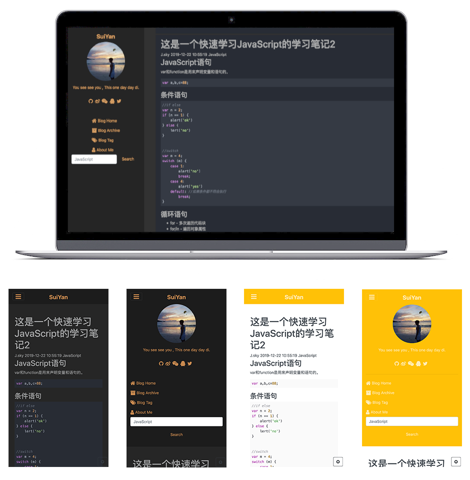

# 碎言静态博客

<a href='https://gitee.com/J_Sky/suiyan/stargazers'></img></a>

### 介绍
碎言这个名称取自与"碎言片语"，码兄累了吗？累了就休息一下，为未来的自己留下一些碎言片语吧。
演示： [碎言博客](http://j_sky.gitee.io/suiyan)

### 软件架构
前端使用了`jQuery，bootstrap4,font-awesome-4.07,marked.js,highlight.js,jqPaginator,less,jQuery.toTop等技术框架。`

本地构建博客索引使用了`Python`的相关技术。

博客文章写作采用Markdown技术支持，让你专注写作更流畅。

### 安装教程

首先克隆下载碎言静态博客，
* [Gitee](https://gitee.com/J_Sky/suiyan.git)
* [GitHub](https://github.com/bosichong/suiyan.git)

安装完成。

### 创建文章

    python z.py -n 此处写文章标题

这个时候就会在`articles`目录下创建一篇文章。[更多终端操作](http://j_sky.gitee.io/suiyan/p.html?p=suiyan_doc/20191230155649)

### 创建索引

博客的文章排序及搜索以来此索引`blog_data.json`，每次创建文章的时候回自动更新索引，但是如果你修改了头部的一些索引信息，则需要运行命令来更新索引。

    python z.py -i

### 修改博客及站长资料

`config.json`里存放着一些站点的资料，上传前建议先修改成自己的资料。

[`config`配置详解点击查看](http://j_sky.gitee.io/suiyan/p.html?p=suiyan_doc/20191231133518)

### 运行站点

推荐使用`Live Server`这个vscode得插件，非常方便。

### 修改站点样式

碎言博客内置了八套网站样式，四套light四套dark，修改四个html页面的外链CSS连接即可。

具体修改方法请点击查看： [细说修改碎言博客站点的样式](http://j_sky.gitee.io/suiyan/p.html?p=suiyan_doc/20191230201529)

### 部署

    git push origin master

提交所有文件到git仓库即可。

#### 参与贡献

1.  Fork 本仓库
2.  新建 Feat_xxx 分支
3.  提交代码
4.  新建 Pull Request

