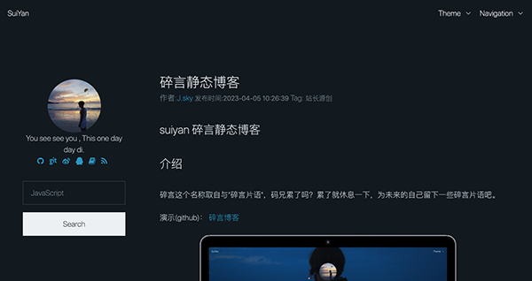
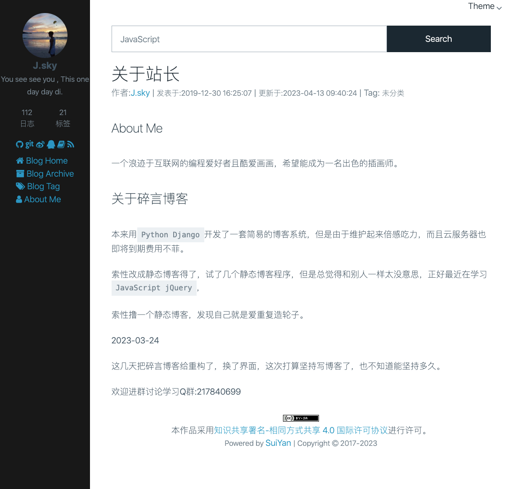
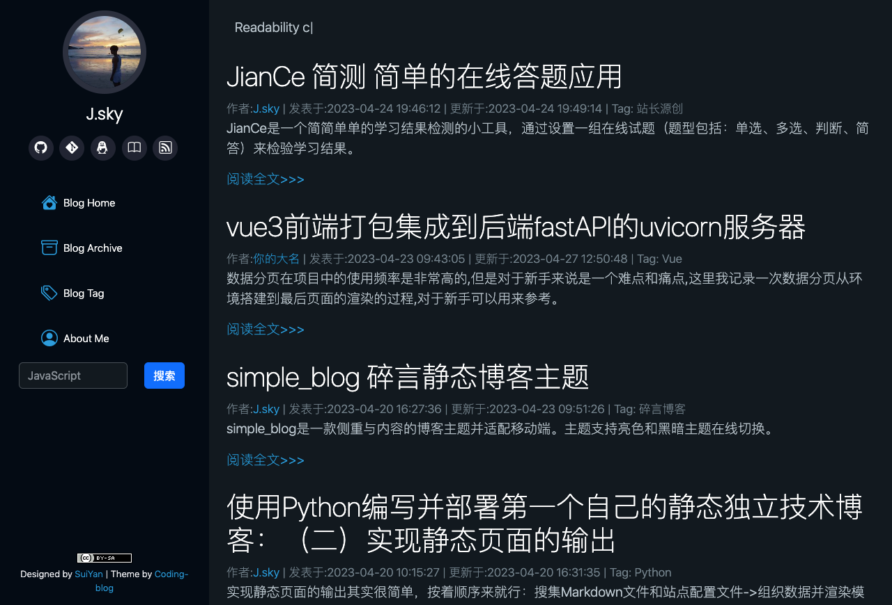

## suiyan 碎言静态博客

### 介绍
碎言这个名称取自与"碎言片语"，码兄累了吗？累了就休息一下，为未来的自己留下一些碎言片语吧。

演示(github)： [碎言博客](http:/suiyan.cc/)

在线一键切换明暗色调。

### 博客主题

除了上边的默认主题，还有其他额外出题。

#### free_blog 

大道至简，返璞归之，这是一款侧重与内容的博客主题 本项目为碎言静态博客主题。 主题支持亮色和黑暗主题在线切换。

[free_blog主题下载地址](https://github.com/bosichong/suiyan_free_blog)

#### simple_blog 

simple_blog是一款侧重与内容的博客主题并适配移动端。 本项目为碎言静态博客主题。 主题支持亮色和黑暗主题在线切换。

[simple_blog主题下载地址](https://github.com/bosichong/simple_blog)

#### coding_blog 

这是一款适合程序员的简约blog主题，使用了Bootstrap 5.3 等框架，模板设计移动优先。
[simple_blog主题下载地址](https://github.com/bosichong/coding_blog)

使用其他主题，将主题复制到`theme`目录中，修改配置文件中的"theme": "主题目录",即可启用。

### 软件架构

2023-03-24 新版 3.0.0 发布啦！

集成了jinja2的模板引擎，大大的提高了静态页面的构建速度， 支持模板主题的制作。

使用了asyncio和aiofiles模块来实现异步IO操作，提高了生成静态博客页面的效率，几百页面瞬间生成。

更新当前博客主题：使用了pico.css样式，大道至简，返璞归真，没有组件，只有HTML标签。

构建博客索引并可以通过标题进行全站搜索。

博客文章写作采用Markdown技术支持，让你专注写作更流畅。

推荐使用Vscode搭配进行blog文章的编写(因为当创建新文章后会直接使用vscode直接打开)

如果新建blog文章无法在vscode中打开，请在命令面板中搜索shell，在PATH 中安装code命令。

### 安装教程

首先克隆下载碎言静态博客，
* [Gitee](https://gitee.com/J_Sky/suiyan)
* [GitHub](https://github.com/Jsky2020/suiyan)

终端运行:

    pip install -r requirements.txt

如果速度太慢请使用镜像：

    pip install -r requirements.txt -i https://pypi.tuna.tsinghua.edu.cn/simple/

安装相关依赖。需要Python版本3.8+之后的版本

博客的管理支持终端和图形界面：

图形界面：

    python3 w.py

终端启动命令：

    python s.py

可以根据自己的喜好进行选择。

### 目录结构

下边是一个完整的项目结构，有些目录需要创建md文件和生成静态文件后才会显示。

    ├── LICENSE 开源协议
    ├── README.md 说明文档
    ├── articles md文件存放目录（名称可以自定义）
    ├── blog 静态文件存放目录（名称可以自定义）
    ├── config.json 站点配置文件
    ├── logs 日志存放目录
    ├── requirements.txt 依赖文件
    ├── s.py 主程序和终端操作命令行
    ├── seo 这里存放着一些SEO文件，比如验证，robots.txt
    ├── theme 主题目录，下边的每一个目录对应一个主题，可以在配置文件里修改主题
    ├── utils.py 程序依赖的方法
    └── w.py 窗口操作的程序

### 首次运行

首次运行建议先修改根目录下的配置文件`config.json`,这里简单介绍一下配置项:

    {
        "dev": 0,  # 调试模式，如果改为1，则使用"blog_test_url"来添加静态资源地址前缀，方便本地调试。
        "blog_name": "碎言博客",   # 站点名称
        "blog_name_en": "SuiYan", # 站点英文名称
        "blog_author": "J.sky", # 站长昵称
        "blog_description_en": "You see see you , This one day day di.",  # 站长简介
        ## 下边是网页中的meta
        "meta_description": " Python Django JavaScript 学习讨论,我们是一群热爱Python的程序员，人生苦短，我用JavaScript！一个不会JavaScript的Python开发者不是一个好网管。",
        "meta_keywords":"Python,Django,JavaScript,程序员,人生苦短,我用Python",
        "profile_image":"assets/images/touxiang.jpg",  # 头像地址
        "blog_bg": "assets/pexels-masha-raymers-3068711.jpg", #当前站点背景图片地址
        "theme": "default_theme", # 当前使用的主题目录名称
        "build": "blog", # 静态文件的目录名称
        "md_dir": "articles", #md文件目录
        "blog_page_num":4,# 静态站点首页的数据分页数值
        "blog_test_url":"http://127.0.0.1:5500/blog/", #本地调试是的测试地址前缀
        "blog_url":"https://suiyan.cc/", # 你的域名，生产模式使用
        "github":"", # 这个是你的仓库地址前缀，暂时无用。
        # sns 图标 和地址，图标的选择，后边会说。
        "blog_sns": [
            {
                "ico": "github",
                "url": "https://github.com/bosichong/suiyan"
            },
            {
                "ico": "git",
                "url": "https://gitee.com/J_Sky/suiyan"
            },
            {
                "ico": "weibo",
                "url": "https://weibo.com/qq285911"
            },
            {
                "ico": "qq",
                "url": "https://user.qzone.qq.com/285911/"
            },
            {
                "ico": "book",
                "url": "https://www.zhihu.com/people/J_sky/activities"
            },
            {
                "ico": "rss",
                "url": "https://suiyan.cc/rss.xml"
            }
        ],
        # 站点的导航
        "nav": [
            {
                "ico": "home",
                "text": "Blog Home",
                "url": "index.html"
            },
            {
                "ico": "archive",
                "text": "Blog Archive",
                "url": "archives.html"
            },
            {
                "ico": "tags",
                "text": "Blog Tag",
                "url": "tags.html"
            },
            {
                "ico": "user",
                "text": "About Me",
                "url": "aboutme.html"
            }
        ]
    
    }

配置文件可以根据自己的需要添加删除，在jinja2 模板中使用`{{ 属性名称 }}`来调用。

修改完毕后就可以创建新文章了。

### 创建文章

    python z.py -n 此处写文章标题

注意！文章标题为必填！

这个时候就会在`articles`目录下创建一篇文章,并且使用`vscode`直接打开。
如果你没有安装`vscode`的命令行，需要安装后才会打开，但是文件会被创建

### 修改博客及站长资料

`config.json`里存放着一些站点的资料，上传前建议先修改成自己的资料。

### 运行站点

本地主题开发编写，推荐使用`Live Server`这个vscode得插件，非常方便。
在配置文件里修改：
"dev": 1,  # 调试模式，如果改为1，则使用"blog_test_url"来添加静态资源地址前缀，方便本地调试。

### 修改站点样式

采用jinja2模板引擎，在主题或是模板目录修改样式，一键生成页面，直接同步页面。
在jinja2 模板中使用`{{ 属性名称 }}`来调用。

使用其他主题，将主题复制到`theme`目录中，修改配置文件中的"theme": "主题目录",即可启用。

站点图标：
[FontAwesome 4.7.0 中完整的675个图标样式CSS参考](https://9iphp.com/fa-icons)

### 部署

    git push origin master

提交`blog`目录下所有文件到git仓库即可，`blog`就是所有博客的全部文件！

### github pages

如何部署GitHub pages 搭建自己的博客，这里就不在详细介绍了，请参考下文。

[GitHub Pages 快速入门](https://docs.github.com/zh/pages/quickstart)

除了部署GitHub，也可以将静态文件部署到虚拟主机云服务器上，复制静态文件目录下的所有文件到你的站点目录下即可。

