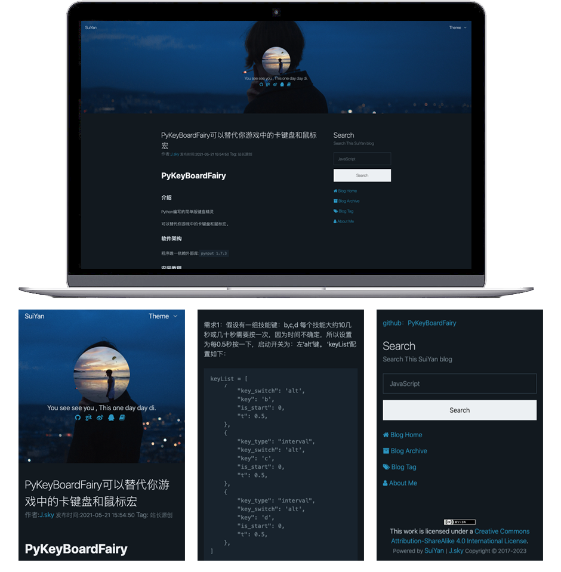
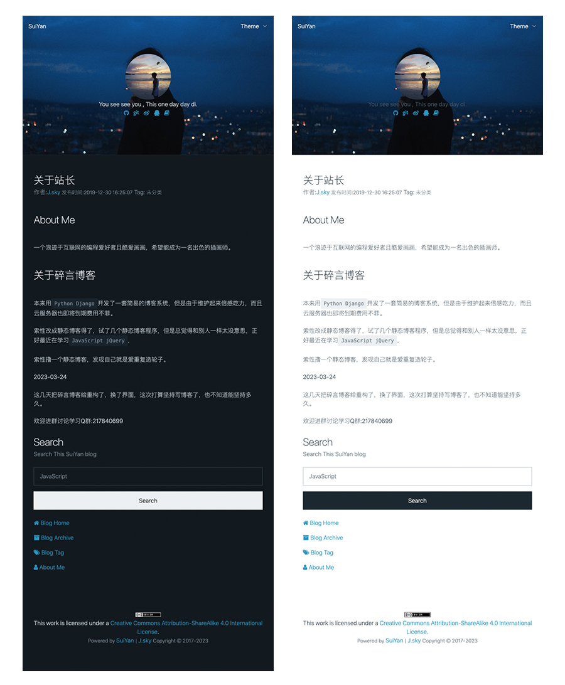
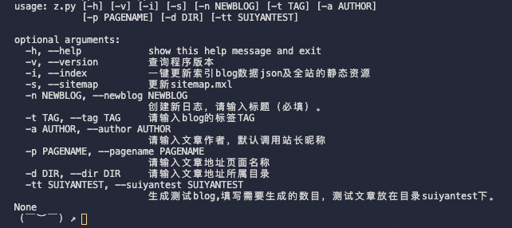

## suiyan 碎言静态博客

### 介绍
碎言这个名称取自与"碎言片语"，码兄累了吗？累了就休息一下，为未来的自己留下一些碎言片语吧。

演示(github)： [碎言博客](http:/suiyan.cc/)

一键切换主题，自动主题。

### 软件架构

2023-03-24 新版 3.0.0 发布啦！

把之前在Python代码中使用字符串拼接组装HTML的方式更换成了jinja2的模板引擎，大大的提高了前端页面的构建速度，
之后需要丰富页面内容就简单多了。使用了asyncio和aiofiles模块来实现异步IO操作，提高了生成静态博客页面的效率，几百页面瞬间生成。

博客支持主题：当前使用了`pico.css`样式，大道至简，返璞归真，没有组建，只有HTML标签。

构建博客索引并可以通过标题进行全站搜索。

博客文章写作采用Markdown技术支持，让你专注写作更流畅。

推荐使用`Vscode`搭配进行blog文章的编写(因为当创建新文章后会直接使用`vscode`直接打开)

如果新建blog文章无法在`vscode`中打开，请在命令面板中搜索`shell`，在PATH 中安装`code`命令。

博客的管理支持终端和图形界面：

图形界面：

    python3 w.py

终端启动命令：

    python s.py

可以根据自己的喜好进行选择。

### 安装教程

首先克隆下载碎言静态博客，
* [Gitee](https://gitee.com/J_Sky/suiyan)
* [GitHub](https://github.com/Jsky2020/suiyan)

终端运行:

    pip install -r requirements.txt

安装相关依赖

安装完成。

### 创建文章

    python z.py -n 此处写文章标题

这个时候就会在`articles`目录下创建一篇文章,并且使用`vscode`直接打开。

### 修改博客及站长资料

`config.json`里存放着一些站点的资料，上传前建议先修改成自己的资料。

### 运行站点

本地主题开发编写，推荐使用`Live Server`这个vscode得插件，非常方便。

### 修改站点样式

采用jinja2模板引擎，在主题或是模板目录修改样式，一键生成页面，直接同步页面。

### 部署

    git push origin master

提交`blog`目录下所有文件到git仓库即可，`blog`就是所有博客的全部文件！

#### 参与贡献

1.  Fork 本仓库
2.  新建 Feat_xxx 分支
3.  提交代码
4.  新建 Pull Request

